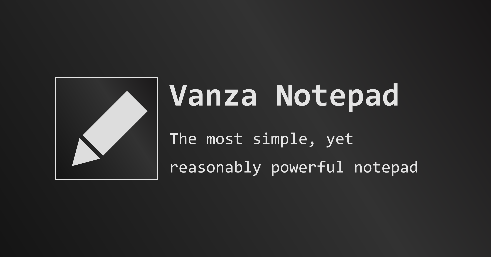

# Vanza Notepad



Vanza Notepad is a part of Tiny Project made by me, Vanza Setia. This notepad is for everybody who understands "tiny but mighty" and appreciates independent developers. Please think about this carefully.

The purpose of this project is not to showcase hard skills, but rather to appreciate how few lines of code are helpful for _real_ human beings.

## What are the benefits of Vanza Notepad?

- No ads.
- No trackers.
- No proprietary JavaScript.
- Zero bloat.
- Written in simple HTML, modern CSS, and clean JavaScript.
- Hackable.
- Use the Grammarly browser extension or any other extension easily.
- Built to last for _at least_ 30 years (or as long as HTML, CSS, and JavaScript are supported).
- Free/libre web app.
- Privacy first.
- Human first.
- No profiling.
- No logging.
- No unnecessary third-party code.
- No complexity.
- No vendor lock-in.
- Easy to back up.
- Write in any text format.
- Runs on many browsers.
- Responsive design.
- No server-side code.
- Human design.
- No cullter.
- No AI, _unless_ you add it.
- Easy to self-host.
- Light and dark mode.
- Automatically saved as you type.
- Sync across browser tabs on a device.

## Can I use it now?

Sure! <https://notepad.vanzasetia.xyz/>

## How can I run it locally?

Use any modern browser to run [the HTML file](./index.html). You do not need Node.js to run an HTML file.

But if you already have Node.js LTS installed, run the following command:

```bash
npm install
```

Then, format the code with the following command:

```bash
npm run format
```

## How can I contribute?

Currently, I do not accept code contributions. But I want to know your feedback. You can reach me through my email:

1. Write "vanzasetia"
1. Write "@proton.me"
1. If you are a human, you know my email now.

## What should I write?

Don't feel burdened about the question, "How do you improve yourself now?" It is a general question. You can improve yourself however you like. This means you can write whatever you want.

## What is the project's license?

Vanza Notepad is distributed under the terms of [Apache License 2.0](https://www.apache.org/licenses/LICENSE-2.0.txt).
